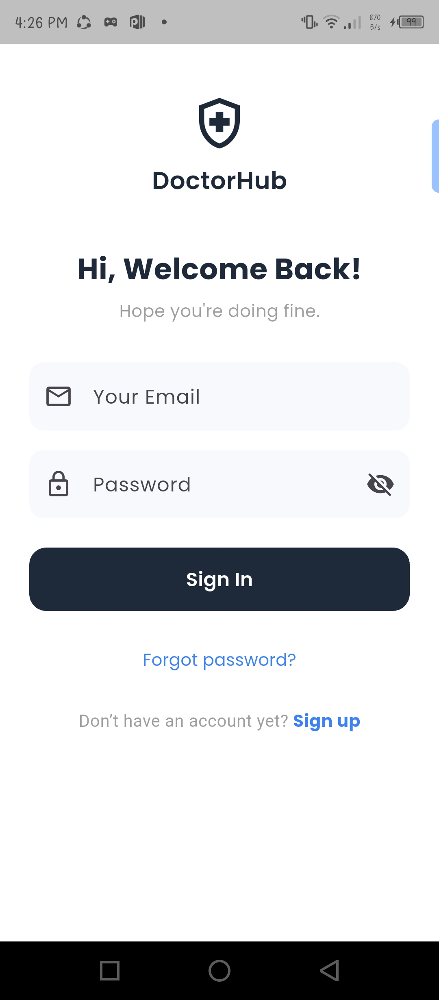
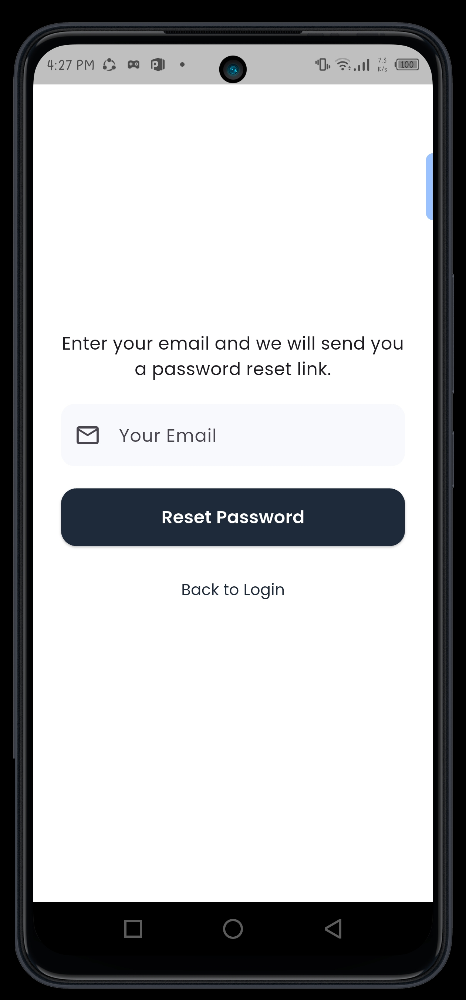

# 🩺 CareMama

CareMama is a Flutter-based healthcare mobile application designed to help users find doctors, manage profiles, and book medical appointments easily.

The app focuses on simplifying healthcare access with a clean and user-friendly interface.

---

# 🚀 Features

- 🔐 Firebase Authentication
- 👨‍⚕️ Doctor Profile System
- 📅 Doctor Appointment Booking
- 👤 User Profile Management
- 🛡 Admin Approval System
- 🔔 Notification System
- ☁️ Cloud Firestore Database
- 📱 Modern Flutter UI

---

# 🛠 Tech Stack

## Frontend
- Flutter
- Dart

## Backend
- Firebase Authentication
- Cloud Firestore
- Firebase Storage

## Tools
- Git
- GitHub
- VS Code

---

# 📂 Project Structure

CareMama
│
├── lib
│ ├── screens
│ ├── widgets
│ ├── models
│ ├── services
│ └── main.dart
│
├── assets
│ └── GitImage
│
├── android
├── ios
└── pubspec.yaml

---

# 📸 App Screenshots

## Login Screen

## Sign Up

## Reset Password

## User Dashboard

## User Profile

## Doctor Details

## Doctor Booking

## Doctor Verification

## Doctor Pending Account

## Admin Dashboard

## Admin Approval

---

# ⚙️ Installation

Clone the repository

git clone https://github.com/raisul-dev/CareMama.git

Go to project folder

cd CareMama

Install dependencies

flutter pub get

Run the app

flutter run

---

# 🔐 Firebase Setup

Make sure Firebase is configured correctly.

Required configuration files:

Android

android/app/google-services.json

iOS

ios/Runner/GoogleService-Info.plist

---

# 📈 Future Improvements

- AI Health Assistant
- Online Doctor Consultation
- Video Call Appointment
- Medicine Reminder
- Health Record Storage

---

# 🤝 Contributing

Contributions are welcome!

Steps:

1. Fork the repository
2. Create a feature branch
3. Commit your changes
4. Push the branch
5. Create a Pull Request

---

# 👨‍💻 Author

Raisul Islam  
Flutter Developer | CSE Student

GitHub  
https://github.com/raisul-dev

---

# ⭐ Support

If you like this project, please give it a ⭐ on GitHub.
